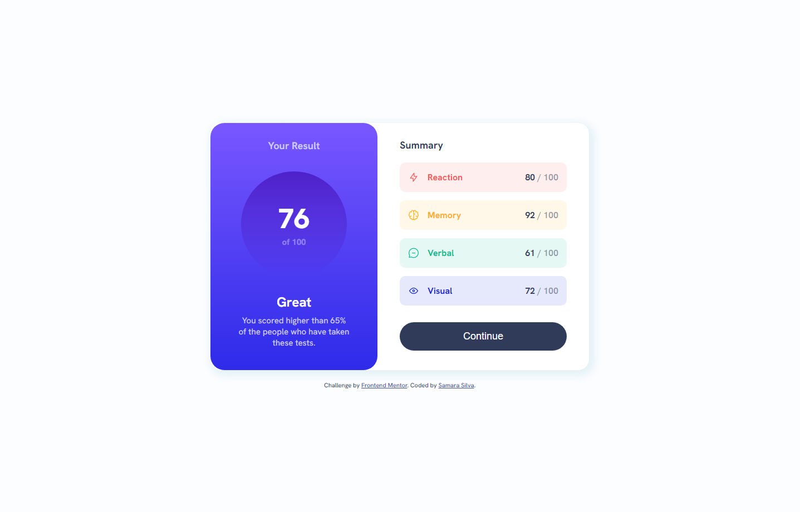
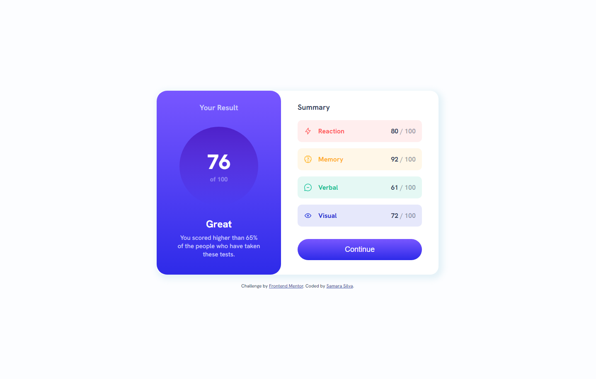
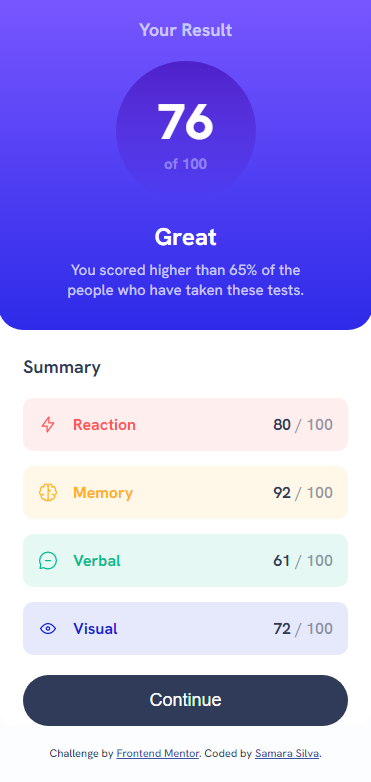

# Frontend Mentor - Results summary component solution

This is a solution to the [Results summary component challenge on Frontend Mentor](https://www.frontendmentor.io/challenges/results-summary-component-CE_K6s0maV). Frontend Mentor challenges help you improve your coding skills by building realistic projects. 

## Table of contents

- [Overview](#overview)
  - [The challenge](#the-challenge)
  - [Screenshot](#screenshot)
  - [Links](#links)
- [My process](#my-process)
  - [Built with](#built-with)
  - [What I learned](#what-i-learned)
  - [Continued development](#continued-development)
  - [Useful resources](#useful-resources)
- [Author](#author)

## Overview

In this README I go over my process of development for this challenge, the things I learned and the tools I used trying to get my page as close to the design as possible.

### The challenge

Users should be able to:

- View the optimal layout for the interface depending on their device's screen size
- See hover and focus states for all interactive elements on the page

### Screenshot





### Links

- Solution URL: [](https://github.com/samarasilva18/results-summary-component-main)
- Live Site URL: [](https://samarasilva18.github.io/results-summary-component-main/)

## My process

1. I decided to go with a Mobile-First workflow this time around. Which meant that I first made a simple flexbox with flex-direction: column, and focused on structuring the HTML and CSS to better match the mobile view of it.
2. I built and stylized the results div first, then the summary, then the list, then the button.
3. I then used @media (min-width: 800px) to set a different CSS for desktop! Having already stylized everything in mobile form first, it was surprisingly easy and quick to get it working. Mobile-first workflow rules.
4. Then I made the active :hover state for the button.
5. This was the hardest part. I decided to delete the static list I had already made and remake it in dynamic form, using the data.json. I probably spent the longest just trying to figure out how it worked, but it worked out in the end! I'm happy how it turned out. I'm pretty sure there must be way better ways to get it to work, so I'll keep training that.
6. I wrote the README.
7. I created the repository in Github and uploaded the project.

### Built with

- CSS custom properties
- Flexbox
- Dynamic content using JSON
- Mobile-first workflow

### What I learned

I hadn't used hsla() before, nor linear-gradients so this was very fun to learn. It's great to be able to make colors more transparent and gradients are very nice to look at and fun to try to get right.
```css
main .result .result-number{
  background: linear-gradient(hsla(256, 72%, 46%, 1), hsla(241, 72%, 46%, 0));
}
```

This took me a while to figure out. I still feel like I could've made the classname part in a better way, but it was really cool learning how to create HTML components using data from a JSON file! I should try to do this more often until I get it better.

```js
var summary = document.getElementById('container');

fetch('./data.json').then(response => response.json()).then(data => {
  data.forEach(element => {
    var classname = getClassNameByCategory(element.category);
    const list = document.createElement('div');
    list.innerHTML = `<li class= ${classname}><p>${element.category}</p><span>${element.score}<a> / 100</span></a></span>`
    summary.appendChild(list)
        });
      }).catch(error => console.error('Error:', error));
```

### Continued development

As I went through this solution, I realized that I really need to brush up on making pages dynamically using JSON and Javascript. That was one of the most difficult parts for me, so I'll try to exercise that more and more until I can do it comfortably just like I can do regular static CSS. 

### Useful resources

- [Adding a class depending on JSON Data](https://stackoverflow.com/questions/41121631/add-class-depending-on-json-data) - This helped me figure out a way to change the class of each of the components I was making through the JSON.
- [A Complete Guide to CSS Gradients](https://css-tricks.com/a-complete-guide-to-css-gradients/) - This is an amazing guide which helped me understand CSS gradients! I'd recommend it to anyone still learning this concept.
- [How to Draw a Circle Using the CSS Border Radius Property](https://blog.hubspot.com/website/css-border-radius-circle) - This is a great step-by-step article showing how to make a perfect circle in CSS, helpful for the circle in the solution.

## Author

- Frontend Mentor - [@samarasilva18](https://www.frontendmentor.io/profile/samarasilva18)
- Github - [samarasilva18](https://github.com/samarasilva18)